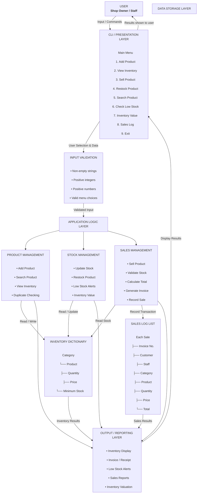
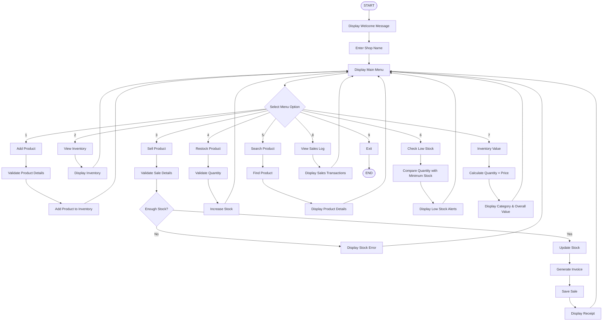
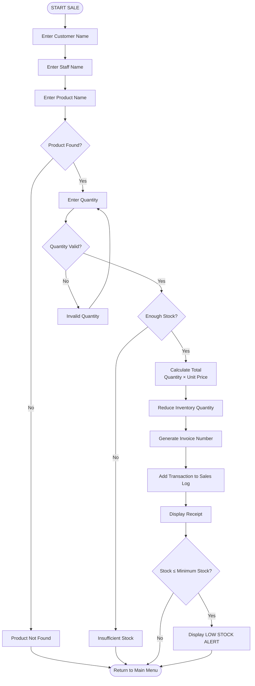
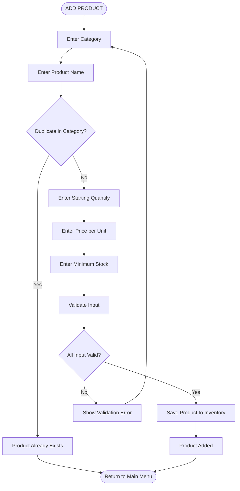
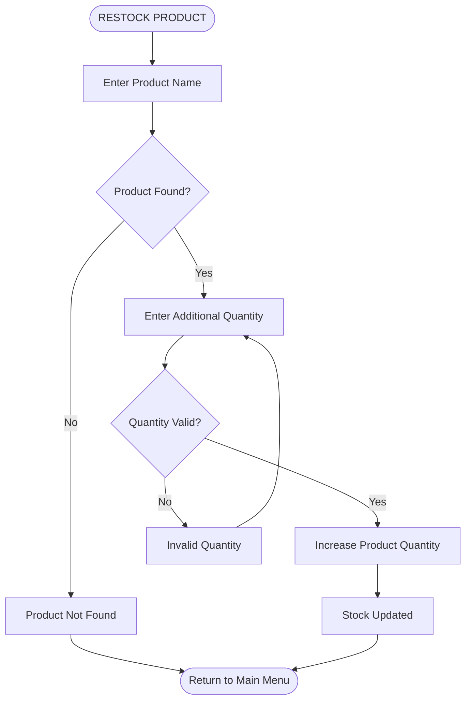
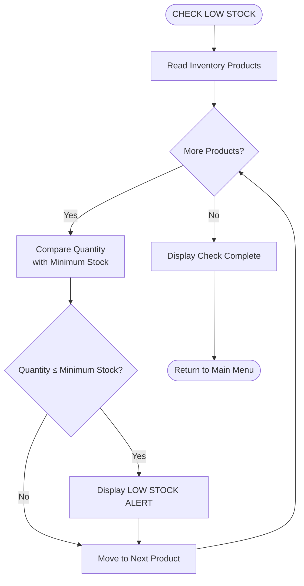
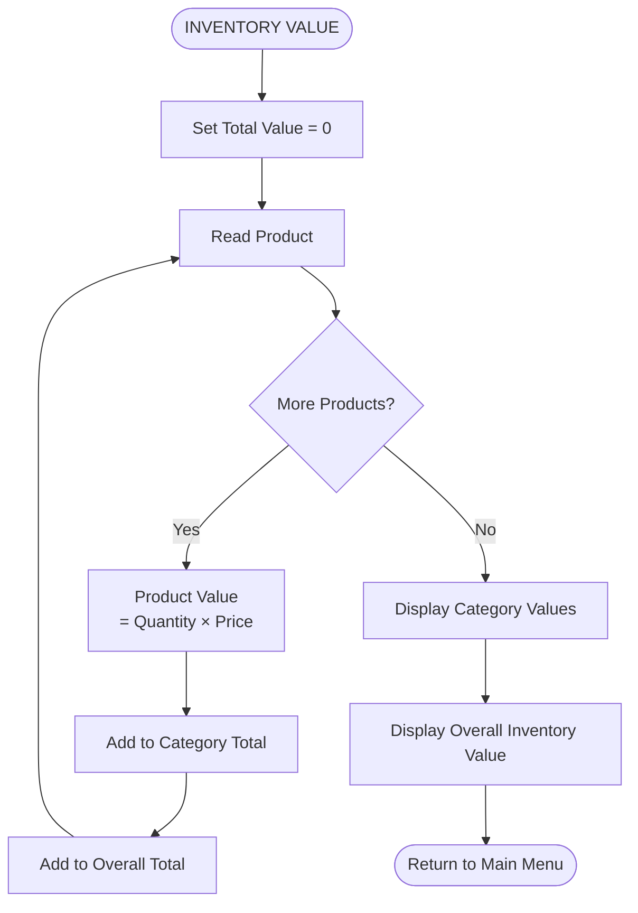
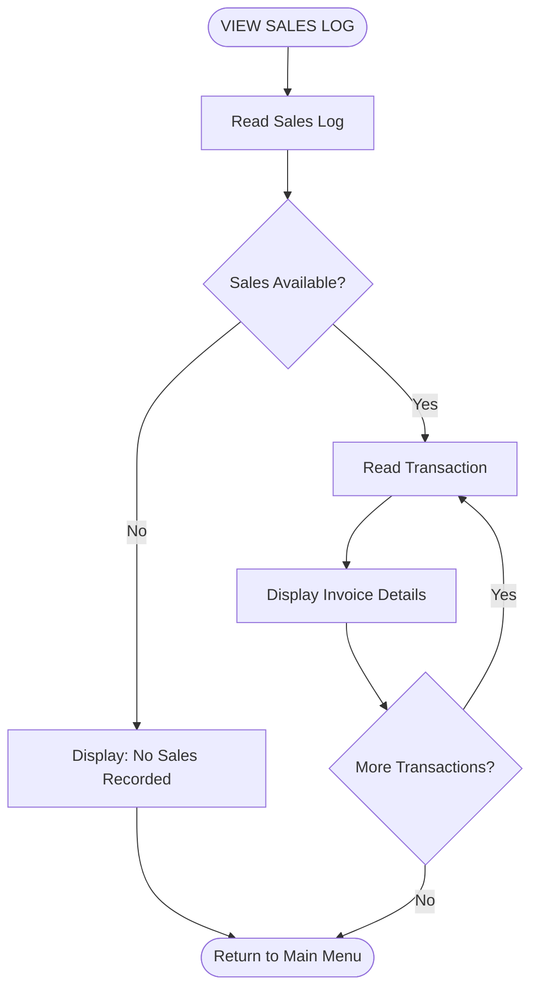
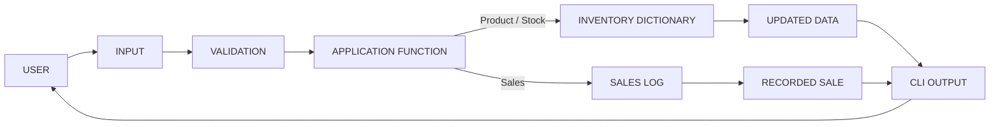

# Shop Inventory Manager

A professional **Python-based command-line Inventory Management System** designed for small shops. The application helps shop owners and staff manage products, monitor stock levels, record sales, generate invoice details, restock products, search inventory, and track inventory value.

---

##  About the Project

The **Shop Inventory Manager** is a console-based application developed using Python.

It allows a shop to:

-  Add and manage products
-  Organize products by category
-  Track available stock
-  Sell products and generate invoice details
-  Restock products
-  Search for products
-  Monitor low-stock items
-  Calculate total inventory value
-  Maintain a sales log

The project focuses on applying fundamental Python programming concepts such as **functions, dictionaries, lists, loops, conditional statements, input validation, and data management**.

> **Storage note:** The current version uses Python's in-memory `dictionary` and `list` data structures. Data is not persisted after the program terminates.

---

#  Features

## 1.  Add Product

Add a new product by providing:

- Category
- Product name
- Starting quantity
- Price per unit
- Minimum stock level

The application prevents duplicate products within the same category.

---

## 2.  View Inventory

Displays all currently available products along with:

- Category
- Product name
- Quantity
- Price
- Minimum stock level

Example:

```text
Category: Grocery
Product  Quantity  Price  Min Stock
Rice     20        60     5
```

---

## 3.  Sell Product

The system allows staff to record a sale by entering:

- Customer name
- Staff name
- Product name
- Quantity

After a successful sale:

- Stock quantity is automatically reduced.
- Total price is calculated.
- An invoice number is generated.
- The transaction is added to the sales log.
- A receipt is displayed.

---

## 4.  Restock Product

Products can be restocked by entering the product name and the additional quantity.

The system automatically updates the available stock.

---

## 5.  Search Product

Search for a product by name and view:

- Category
- Available quantity
- Price
- Minimum stock level

---

## 6.  Low Stock Alerts

Each product has a minimum stock level.

When the available quantity becomes equal to or lower than this level, the system displays a **LOW STOCK ALERT**.

Example:

```text
[LOW STOCK] Rice (Grocery): 4 left, min is 5
```

---

## 7. Total Inventory Value

The application calculates the value of the current inventory using:

```text
Inventory Value = Quantity × Price per Unit
```

It displays the value for each category as well as the overall inventory value.

---

## 8.  Sales Log

The application maintains a record of completed sales containing:

- Invoice number
- Customer
- Staff member
- Category
- Product
- Quantity
- Price
- Total amount

The sales log can be viewed from the main menu.

---

## 9.  Exit

The user can safely exit the application through option **9**.

---

# System Architecture

The Shop Inventory Manager follows a **layered, menu-driven, function-based architecture**.  
The flow starts with the **Shop Owner / Staff**, passes through the **CLI and input validation**, reaches the appropriate **application module**, updates the required **in-memory data structure**, and finally returns the result to the user through the **Output / Reporting layer**.

##  Complete Block Architecture Diagram



### Architecture Flow

```text
┌──────────────────────────────┐
│        USER / STAFF        │
│      Shop Owner / Staff      │
└──────────────┬───────────────┘
               │
               │ User Input
               ▼
┌──────────────────────────────┐
│      CLI / MAIN MENU       │
│                              │
│  Add | View | Sell | Restock │
│  Search | Low Stock | Value  │
│  Sales Log | Exit            │
└──────────────┬───────────────┘
               │
               │ Selected Option
               ▼
┌──────────────────────────────┐
│      INPUT VALIDATION      │
│                              │
│ Strings • Integers • Prices  │
│ Quantities • Menu Choices    │
└──────────────┬───────────────┘
               │
               │ Validated Input
               ▼
┌────────────────────────────────────────────┐
│           APPLICATION LOGIC              │
│                                            │
│ ┌────────────────┐ ┌────────────────────┐ │
│ │  PRODUCT     │ │   STOCK           │ │
│ │ MANAGEMENT     │ │ MANAGEMENT         │ │
│ │                │ │                    │ │
│ │ Add            │ │ Restock            │ │
│ │ Search         │ │ Update Stock       │ │
│ │ View           │ │ Low Stock          │ │
│ └───────┬────────┘ │ Inventory Value    │ │
│         │          └─────────┬──────────┘ │
│         │                    │            │
│         │   ┌──────────────────────────┐ │
│         └──►│  SALES MANAGEMENT      │ │
│             │                          │ │
│             │ Sell • Invoice • Record │ │
│             └────────────┬─────────────┘ │
└──────────────────────────┼────────────────┘
                           │
                           ▼
┌────────────────────────────────────────────┐
│              DATA STORAGE                │
│                                            │
│  ┌──────────────────┐  ┌────────────────┐ │
│  │  INVENTORY     │  │   SALES LOG   │ │
│  │ DICTIONARY       │  │ LIST           │ │
│  │                  │  │                │ │
│  │ Category         │  │ Invoice No.    │ │
│  │ Product          │  │ Customer       │ │
│  │ Quantity         │  │ Staff          │ │
│  │ Price            │  │ Product        │ │
│  │ Min Stock        │  │ Quantity       │ │
│  └────────┬─────────┘  │ Price / Total  │ │
│           │            └───────┬────────┘ │
└───────────┼────────────────────┼──────────┘
            │                    │
            └──────────┬─────────┘
                       ▼
┌──────────────────────────────┐
│        OUTPUT / REPORTS    │
│                              │
│ Inventory • Receipt • Alerts │
│ Sales Log • Inventory Value  │
└──────────────┬───────────────┘
               │
               │ Display
               ▼
┌──────────────────────────────┐
│        USER / STAFF        │
│       Receives Result        │
└──────────────────────────────┘
```

##  Main Application Flowchart



##  Sell Product Transaction Flow



##  Add Product Flow



##  Restock Flow



##  Low Stock Check Flow



##  Inventory Value Flow



##  Sales Log Flow



##  Complete Data Flow



---

#  Architecture Components

| Component | Responsibility |
|---|---|
| **CLI Interface** | Accepts user input and displays application output |
| **Main Controller** | Controls menu selection and application flow |
| **Input Validation** | Validates strings, integers, and numerical values |
| **Product Management** | Adds, searches, and displays products |
| **Stock Management** | Handles stock updates, restocking, and low-stock monitoring |
| **Sales Management** | Processes sales and maintains transaction records |
| **Inventory Dictionary** | Stores product, quantity, price, category, and minimum stock data |
| **Sales Log** | Stores completed transaction records |
| **Invoice Generator** | Generates invoice/receipt information |
| **Output Layer** | Displays inventory, invoices, alerts, and reports |

---

#  Data Storage

The current application uses Python's built-in data structures for temporary storage.

## Inventory Dictionary

The inventory is stored using nested dictionaries.

Conceptually:

```text
inventory
│
├── category
│   ├── product
│   │   ├── quantity
│   │   ├── price
│   │   └── min_stock
```

Example:

```python
inventory = {
    "grocery": {
        "rice": {
            "quantity": 20,
            "price": 60,
            "min_stock": 5
        }
    }
}
```

This structure organizes products according to their categories.

---

## Sales Log List

Completed transactions are stored in the `sales_log` list.

Each sale is represented as a dictionary containing:

```text
Invoice Number
Customer
Staff
Category
Product
Quantity
Price
Total
```

> **Important:** Because these structures are stored in memory, all data is lost when the application terminates.

---

# Input Validation

The program includes validation functions to reduce invalid user input.

### `get_non_empty_string()`

Ensures that required text fields are not left empty.

### `get_positive_int()`

Ensures that the entered value is a valid whole number.

### `get_positive_float()`

Ensures that the entered value is a valid number.

These functions improve the reliability of the application by preventing invalid input from being processed.

---

#  Main Functions

| Function | Purpose |
|---|---|
| `add_product()` | Adds a new product to inventory |
| `view_inventory()` | Displays current inventory |
| `sell_product()` | Records a sale and updates stock |
| `restock_product()` | Adds stock to an existing product |
| `search_product()` | Searches for a product |
| `check_low_stock()` | Finds products below minimum stock |
| `total_value()` | Calculates inventory value |
| `view_sales_log()` | Displays recorded sales |
| `print_receipt()` | Prints sale/invoice details |
| `find_product()` | Locates a product in inventory |
| `show_menu()` | Displays the main menu |
| `main()` | Controls the application flow |

---

#  Main Menu

When the program starts, it asks for the shop name:

```text
****************************************
  WELCOME TO THE SHOP INVENTORY MANAGER
****************************************

Enter your shop name:
```

After entering the shop name, the main menu is displayed:

```text
----------------------------------------
ABC SHOP - INVENTORY MANAGER
----------------------------------------
1. Add Product
2. View Inventory
3. Sell Product
4. Restock Product
5. Search Product
6. Check Low Stock
7. Total Inventory Value
8. View Sales Log
9. Exit
```

The user can select an option from **1 to 9** to perform the required operation.

---

#  Example Sale

Suppose the shop has:

```text
Product: Rice
Quantity: 20
Price: ₹60
```

A customer purchases:

```text
Quantity: 3
```

The application calculates:

```text
3 × ₹60 = ₹180
```

The inventory is then updated:

```text
Previous Quantity = 20
Sold Quantity     = 3
Remaining Stock   = 17
```

A corresponding invoice is generated and the transaction is added to the sales log.

---

# Inventory Value Example

The inventory value is calculated using:

```text
Inventory Value = Quantity × Price per Unit
```

Example:

```text
Rice
Quantity: 20
Price: ₹60

20 × ₹60 = ₹1,200
```

The application calculates the value for individual products/categories and the overall inventory.

---

#  Technologies Used

- **Python 3**
- Python Dictionaries
- Python Lists
- Functions
- Loops
- Conditional Statements
- Input Validation
- Console/Terminal Interface

### External Libraries

No external libraries are required.

---

#  Project Structure

```text
Shop-Inventory-Manager/
│
├── inventory_manager.py
└── README.md
```

> Replace `inventory_manager.py` with the actual filename of your Python file if it is different.

---

#  How to Run

## Step 1 — Install Python

Make sure Python 3 is installed.

Check your Python version:

```bash
python --version
```

or:

```bash
python3 --version
```

---

## Step 2 — Clone the Repository

```bash
git clone https://github.com/your-username/Shop-Inventory-Manager.git
```

Navigate into the project directory:

```bash
cd Shop-Inventory-Manager
```

---

## Step 3 — Run the Program

```bash
python inventory_manager.py
```

---

#  Current Limitations

This project is currently a **console-based application** and stores data in memory.

Therefore:

- Data is lost when the program is closed.
- There is no database integration.
- There is no graphical user interface.
- There is no user authentication system.
- Sales currently record one product per transaction.
- The application is designed primarily for small-scale shop management.

---

#  Future Improvements

Possible improvements include:

- Add SQLite/MySQL database support
- Create a graphical user interface
- Add login and user authentication
- Generate downloadable PDF invoices
- Add sales and inventory reports
- Add sales analytics and charts
- Improve product search
- Support multiple products in a single invoice
- Add persistent data storage
- Deploy the application as a web-based inventory system

---

#  Learning Objectives

This project demonstrates practical use of:

- Python programming fundamentals
- Functions and modular programming
- Dictionaries and lists
- Loops and conditional logic
- Input validation
- Basic inventory management
- Transaction processing
- Data organization
- Problem-solving

---

#  Author

## PRISHA BHATNAGAR

**Project:** Shop Inventory Manager  
**Technology:** Python 3  
**Type:** Console-Based Inventory Management System  
**Purpose:** Learning and Educational Project

---

# Future Scope

The project can be further developed into a complete shop management platform by adding:

-  Database-backed storage
-  Web or desktop interface
-  Authentication and role-based access
-  Advanced inventory management
-  Automated billing
-  PDF invoice generation
---

#  Project Summary

The **Shop Inventory Manager** provides a straightforward command-line solution for managing products, inventory, stock levels, sales, invoices, and inventory valuation.

Its function-based architecture and use of Python dictionaries and lists make it suitable for demonstrating core Python programming concepts while providing a practical foundation that can later be extended with databases, graphical interfaces, authentication, analytics, and cloud deployment.

---

